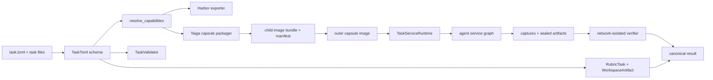

# Native Software Engineering and Long-Horizon Task Framework

This document is the technical reference for native ISO
`software_engineering` tasks, including FrontierBench-style service
environments. It describes the authored schema, shared grader, export paths,
Taiga outer capsule, nested runtime, Harbor projection, security boundaries,
validation, and current limitations.

For task-design guidance, read
[`project_guidelines/software_engineering/frontier_style_software_engineering_tasks.md`](../project_guidelines/software_engineering/frontier_style_software_engineering_tasks.md).
For the workflow to create and calibrate a brand-new problem, read
[`project_guidelines/software_engineering/new_task_design_workflow.md`](../project_guidelines/software_engineering/new_task_design_workflow.md).

## 1. Design Goals

The framework is designed to satisfy these invariants:

1. Authors describe one native task rather than maintaining separate Taiga and
   Harbor implementations.
2. Simple repository tasks remain simple and secure.
3. Stateful service tasks can ship to Taiga as one image that starts nested
   child containers inside a Firecracker VM.
4. The same capability model projects to Harbor Compose and separate-verifier
   contracts.
5. Candidate code never runs directly in the root grader.
6. Hidden fixtures and verifier state remain root-controlled.
7. Artifacts are frozen before trusted grading.
8. Candidate failures produce kept agent-fault rewards; infrastructure failures
   discard rollouts.
9. Images, services, tools, captures, and artifacts are deterministic and
   bounded.
10. Security-sensitive mechanisms live in shared code with shared tests, not in
    unaudited task-local shims.

### 1.1 Author acceptance gate

The framework can prove that a problem is valid, reproducible, and secure, but
task acceptance also includes a difficulty gate:

- every required trusted CI check must be green; and
- the final Boreal aggregate score for the problem must be `<= 0.4`.

The oracle target remains `1.0`, and no-op/attack baselines remain at the floor.
The Boreal aggregate is evaluated only from valid attempts; discarded
infrastructure failures cannot be used to satisfy the threshold.

## 2. Execution Modes

### 2.1 Legacy-compatible single image

The software starter uses the historical one-image task contract:

- no capability sections are required;
- `environment/Dockerfile` creates `/tmp/output/repo`;
- the agent runs as UID 1000;
- the verifier is root;
- hidden data is baked under `/mcp_server/data`;
- the final repository is loaded by `WorkspaceArtifact("repo")`; and
- local/Harbor/Taiga execution uses the standard task image.

This is the preferred mode for focused repository work.

### 2.2 Capability task with implicit main

`is_capability_task()` returns true when a task declares any of:

- `services`,
- `workspace`,
- `artifacts`,
- `captures`,
- `mcp_servers`, or
- `evaluation`.

When no explicit service exists, the exporters synthesize `main` from
`environment/Dockerfile` or `environment/main/Dockerfile` through
`implicit_agent_service()`. That projection preserves:

- authored resource policy;
- `none`, `isolated`, or `internet` networking;
- platform/architecture; and
- the unprivileged main role.

This mode uses an outer capsule on Taiga even though the task has one child
service.

### 2.3 Explicit service graph

When `[[services]]` is non-empty:

- exactly one service has `role = "main"`;
- at most one has `role = "verifier"`;
- every service reference is validated;
- the software contract validates service-qualified repository artifacts;
- Taiga packages all child images into a trusted outer capsule; and
- Harbor receives generated Compose and separate-verifier configuration.

### 2.4 Software validator nuance

Capability export and software grading are related but distinct:

- any capability section opts into capability export;
- the software contract selects its **service-graph** checks only when
  `task_toml.services` is non-empty;
- workspace/evaluation metadata alone does not force a simple software grader
  to declare a verifier service; and
- an invalid explicit service graph never falls back to misleading
  single-image checks.

## 3. Architecture



### 3.1 Main implementation modules

| Layer | File | Primary symbols |
| --- | --- | --- |
| Schema | `alignerr_plugin/src/alignerr_plugin/schemas.py` | `TaskToml`, `WorkspaceSection`, `ServiceSpec`, `ArtifactSpec`, `CaptureSpec`, `MCPServerSpec`, `ResultSection` |
| Capability normalization | `alignerr_plugin/src/alignerr_plugin/capabilities.py` | `resolve_capabilities`, `resolve_services`, `project_harbor_task_data`, `implicit_agent_service` |
| Safe materialization | `alignerr_plugin/src/alignerr_plugin/materialization.py` | `materialize_workspace_seed`, `workspace_dockerfile_overlay`, `staged_output_directory` |
| Capsule packaging | `alignerr_plugin/src/alignerr_plugin/capsule.py` | `export_task_capsule`, `export_image_bundle`, `capsule_compose_data` |
| Harbor export | `alignerr_plugin/src/alignerr_plugin/exporters/harbor.py` | `export_harbor`, `capability_compose_data` |
| Taiga payload | `alignerr_plugin/src/alignerr_plugin/exporters/taiga.py` | `build_job_payload`, `_capability_summary` |
| Runtime config | `taiga_runtime/rubric/src/rubric/service_config.py` | `load_task_service_config`, `TaskServiceConfig` |
| Runtime lifecycle | `taiga_runtime/rubric/src/rubric/service_runtime.py` | `TaskServiceRuntime` |
| Capsule trust | `taiga_runtime/rubric/src/rubric/capsule_runtime.py` | `CapsuleBundle`, `CapsuleImageArchive` |
| MCP bridge | `taiga_runtime/rubric/src/rubric/tool_runtime.py` | `ToolRegistry` |
| Grader entry | `taiga_runtime/rubric/src/rubric/server.py` | lazy service runtime and finalization |
| Repository artifact | `grader/src/grading/evaluation/artifacts.py` | `WorkspaceArtifact`, `SubmittedWorkspace` |
| Candidate suite | `grader/src/grading/evaluation/candidate_suite.py` | `CandidateCommandSpec`, `run_candidate_suite` |
| Rubric API | `grader/src/grading/evaluation/rubric.py` | `RubricTask`, `RubricContext` |
| Validation | `alignerr_plugin/src/alignerr_plugin/validators/task/validator.py` | `_software_contract_issues`, `_software_capability_issues` |

## 4. Authoring Schema Reference

`TaskToml` rejects unknown top-level sections. Capability models also reject
unknown fields, so misspellings fail instead of silently disabling a contract.

### 4.1 Universal sections

| Section | Purpose |
| --- | --- |
| `[task]` | Name, description, and identity |
| `[environment]` | Taiga resource tier, storage, base flavor, internet policy |
| `[agent]` | Agent timeout, user, per-phase resources |
| `[verifier]` | Verifier timeout, env, user, resources, capabilities |
| `[ground_truth]` | Oracle target, trivial ceiling, in-container behavior |
| `[reference]` | Local reference execution/cache/proof mode |
| `[runner]` | Episode, tools, checkpoint, and Taiga timeouts |
| `[difficulty]` | Task type, domain, reward type |
| `[[outputs]]` | Required `/tmp/output` deliverables |
| `[[preloaded_files]]` | Deploy-time public data mounts |
| `[delivery]` | Delivery routing |
| `[[hint]]` | Optional Taiga hints |

Software tasks use:

```toml
[difficulty]
task_type = "software_engineering"
domain = "repo_debugging"
reward_type = "multi_deterministic_rubrics"
```

### 4.2 `[workspace]`

| Field | Type/default | Behavior |
| --- | --- | --- |
| `seed` | task-relative path | Required unless policy is `empty` |
| `root` | absolute writable path | Workspace root |
| `agent_cwd` | root by default | Must be inside root |
| `init_policy` | `copy` | `copy`, `overlay`, `reuse`, or `empty` |
| `git_baseline` | `true` | Boolean or pinned 40-char lowercase commit |
| `clean_paths` | `[]` | Disposable paths |
| `checkpoint_restore` | `true` | Reuse initialized state after restore |

### 4.3 `ResourceSpec`

Resources can be declared on agent, verifier, and services:

```toml
[agent.resources]
cpus = 8
memory_mb = 16384
storage_mb = 50000
gpus = 0
platform = "linux/amd64"
build_timeout_sec = 1800
runtime_timeout_sec = 21600
network = "isolated"
```

Fields:

- `cpus`
- `memory_mb`
- `storage_mb`
- `gpus`
- `gpu_types`
- `platform`
- `architecture`
- `build_timeout_sec`
- `runtime_timeout_sec`
- `network = "none" | "isolated" | "internet"`

GPU count and types must agree. Platform and architecture are normalized.

### 4.4 `[[services]]`

```toml
[[services]]
name = "main"
role = "main"
user = "agent"
build = {
  context = "environment/main",
  dockerfile = "Dockerfile",
  target = "runtime",
  platform = "linux/amd64",
  pull = false,
  no_cache = false
}
command = ["sleep", "infinity"]
restart = "no"
shm_mb = 1024

[services.env]
DATABASE_HOST = "database"

[services.resources]
cpus = 4
memory_mb = 8192
network = "isolated"
```

Fields:

- `name`
- `role = "main" | "sidecar" | "init" | "verifier"`
- exactly one of `image` or `build`
- `command`
- `user`
- `env`
- `ports`
- `network_mode = "bridge" | "none" | "share"`
- `network_share_target`
- `network_aliases`
- `capabilities`
- `shm_mb`
- `resources`
- `depends_on`
- `restart`
- `healthcheck`
- `volumes`

External images must use a full SHA-256 digest. Main cannot run as root.
Capabilities are allowlisted to `SYS_PTRACE`.

#### `ServiceBuild`

Fields:

- task-relative `context`;
- context-relative `dockerfile`;
- declared local stage `target`;
- build `args`;
- `platform`/`architecture`;
- `pull`; and
- `no_cache`.

Target validation resolves case-insensitive input to the exact declared stage
alias. Missing targets fail before a Docker command can treat them as public
image references.

#### Dependencies

```toml
[[services.depends_on]]
service = "database"
condition = "healthy"
```

Conditions:

- `started`
- `healthy` (target must have a healthcheck)
- `completed` (target must be `init`)

#### Healthcheck

Healthchecks project to Compose and include:

- command/test;
- interval;
- timeout;
- retries;
- start period; and
- optional start interval.

### 4.5 `[[volumes]]`

```toml
[[volumes]]
name = "shared-state"

[[services.volumes]]
volume = "shared-state"
target = "/shared"
mode = "rw"
```

Only named volumes exist in the schema. There is no host-source field.

### 4.6 `[[artifacts]]`

Common fields:

- `name`
- `kind`
- `destination`
- `service` (default `main`)
- `exclude`
- `required`
- `max_bytes`
- `max_files`
- `max_depth`

Kinds:

| Kind | Source |
| --- | --- |
| `file` | `source` regular file |
| `tree` | `source` recursive tree |
| `path_set` | non-empty `sources` |
| `binary` | `source`, optional mode preservation |
| `service` | `source` plus explicit non-main service |

Grouped `[artifacts.limits]` input is accepted and normalized to the flat
fields.

### 4.7 `[[captures]]`

```toml
[[captures]]
name = "state-dump"
service = "database"
command = ["sh", "-lc", "dump > /tmp/state.tmp && mv /tmp/state.tmp /tmp/state"]
timeout_sec = 60
atomic_destination = "/tmp/state"
accepted_exit_codes = [0]
failure_policy = "agent"
```

Capture destinations must be safe `/tmp` paths. Exit codes are unique bytes
from 0 through 255. Failure policy is `agent` or `infrastructure`.

### 4.8 `[[mcp_servers]]`

Common fields:

- `name`
- `service`
- `depends_on`
- `readiness`
- `access = "agent" | "verifier" | "both"`

Transports:

- `stdio`: command, CWD, and env;
- `sse`: validated HTTP/S URL and headers.

Readiness kinds:

- HTTP with accepted statuses;
- TCP host/port; or
- command, optionally in a service.

Taiga outer-capsule export currently accepts audited SSE service endpoints only.

### 4.9 `[evaluation]`

```toml
[evaluation]
engine = "rubric_task"
entrypoint = "scorer/compute_score.py"
hidden_fixtures = ["scorer/data/hidden_cases.json"]
repetitions = 2

[evaluation.metadata]
trusted_post_agent_verifier = true
```

Engines:

- `rubric_task`
- `continuous_task`
- `legacy_runner`

Software tasks use `rubric_task`.

### 4.10 `[[gates]]`

Kinds:

- `structural`
- `behavioral`
- `performance`
- `determinism`
- `static`
- `custom`

Each gate can declare command, required flag, weight, timeout, repetitions,
report reference, and metadata.

### 4.11 `[[reports]]`

Formats:

- `json`
- `ctrf`
- `junit`
- `text`
- `custom`

Each report has a safe destination path, required flag, and byte limit.

### 4.12 `[result]`

```toml
[result]
output_root = "/tmp/output/verifier"
reward_file = "grade.json"
reward_key = "score"
subscores_key = "subscores"
reports = ["behavioral"]
trace_file = "trace.json"
agent_fault_reward = 0.0
infrastructure_fault = "discard"
```

`agent_fault_reward` must be finite and within `[0, 1]`.
`infrastructure_fault` is intentionally fixed to `discard`.

## 5. Cross-Section Validation

`TaskToml._capability_issues()` enforces:

- unique service, volume, artifact, capture, MCP, gate, and report names;
- exactly one main when services are explicit;
- at most one verifier;
- explicit reward fields when a verifier exists;
- valid service/volume/report references;
- no self-dependencies;
- health dependencies only on services with healthchecks;
- completed dependencies only on init services;
- valid network-share targets;
- no self-shared network namespace;
- unique mount targets;
- unique MCP dependencies;
- MCP names that do not collide with built-in tools;
- result/report coherence;
- workspace/result path separation; and
- valid writable/output roots.

Capability normalization adds trust checks:

- agent services cannot depend on verifier;
- verifier cannot depend on agent services unless explicitly trusted as a
  post-agent verifier;
- verifier cannot share named volumes with agent services; and
- no network namespace share can cross the verifier boundary.

## 6. Workspace Materialization

### 6.1 Export-time behavior

`materialize_workspace_seed()`:

- resolves task-relative seeds;
- rejects escaping symlinks;
- copies directories/files safely;
- supports commit-pinned Git metadata;
- bounds Git metadata and reachable objects;
- removes unsafe config, hooks, alternates, and linked worktrees;
- normalizes ownership/modes/timestamps for deterministic output; and
- updates `.dockerignore` so every materialized seed remains in build context.

`workspace_dockerfile_overlay()`:

- creates the workspace root;
- copies `.alignerr-workspace-seed`;
- applies copy/overlay policy;
- creates or verifies the Git baseline;
- sets UID 1000 ownership for the agent;
- sets the working directory; and
- restores root for verifier overlays where needed.

### 6.2 Runtime behavior

`TaskServiceRuntime._initialize_workspace()`:

- reads runtime config from packaged `task.toml`;
- uses a marker to detect compatible restored state;
- honors `checkpoint_restore`;
- applies `copy`, `overlay`, `reuse`, or `empty`;
- enforces the requested Git baseline; and
- fails closed on inconsistent existing state.

## 7. Service Projection and Compose Hardening

`resolve_services()` converts typed or mapping input into internal
`ServiceSpec` values. `_compose_projection()` projects:

- command;
- environment;
- ports;
- dependencies;
- healthcheck;
- named volumes;
- network policy and aliases;
- capability additions;
- shared memory;
- restart;
- CPU/memory/GPU limits; and
- selected safe Compose fields.

The projection rejects:

- host bind volumes;
- Docker/containerd sockets;
- orchestration environment variables;
- unsupported Linux capabilities;
- privileged mode;
- host devices;
- unsafe `volumes_from`;
- unpinned external images;
- contradictory aliases/network modes; and
- protected runtime path access.

Generated capsule services add:

- `pull_policy: never`;
- `cap_drop: ALL`;
- `security_opt: no-new-privileges:true`; and
- forced `network_mode: none` for the verifier.

## 8. Artifact and Capture Lifecycle

The nested runtime finalization order is security-sensitive:

1. Run declared captures in order.
2. Verify atomic capture destinations.
3. Pause agent-reachable services.
4. Collect bounded artifacts from declared services.
5. Reject symlinks, special files, escapes, and limit violations.
6. Write a root-owned `lbx-service-artifacts.v1` manifest.
7. Stop the agent graph.
8. Start the verifier with no network and a read-only sealed snapshot.
9. Read the canonical result.
10. Tear down Compose, nested Docker, and runtime state.

This order prevents the agent from changing evidence after snapshot and prevents
the verifier from reading mutable agent volumes.

## 9. MCP/SSE Runtime

`ToolRegistry` exposes declared MCP servers:

- service hosts must be declared;
- resolved destinations must stay inside the allowed service graph;
- scheme, host, port, and path are checked;
- loopback/private service addresses are expected;
- arbitrary external URLs are rejected;
- request/response payloads are bounded;
- readiness runs before tool use; and
- access is filtered by agent/verifier phase.

The rubric MCP server exposes task-local list/call methods backed by the lazy
`TaskServiceRuntime`.

## 10. Taiga Outer Capsule

### 10.1 Packaging pipeline

```text
load TaskToml
  -> resolve capabilities
  -> validate child images/builds/resources
  -> trusted build/pull child images
  -> inspect image identities/platforms
  -> write deterministic image archive + manifest
  -> write capsule Compose + task files + runtime
  -> build one outer image
  -> push digest-pinned outer image
  -> export Taiga metadata with --outer-capsule
```

### 10.2 Capsule files

The context contains:

```text
Dockerfile
docker-compose.yaml
manifest.json
images/
  images.docker.tar
  images.manifest.json
task/
grader/
taiga_runtime/rubric/
base/runtime support
```

The image manifest records image references, IDs, digests, platforms, and
archive integrity. Runtime verifies the archive before loading it.

### 10.3 Trusted build boundary

Child image builds and pulls require:

```bash
lbx-rl-template export-capsule --trusted-build
```

The flag is intended for trusted CI. Without it, packaging fails closed.

### 10.4 Resource policy

Taiga nested Docker currently supports CPU Firecracker tiers. Export rejects:

- child GPU/TPU declarations;
- incompatible architecture/platform;
- an outer tier smaller than projected peak needs; and
- capability metadata that claims a non-capsule image.

The payload includes `alignerr.taiga.capability-summary.v1` with services,
resources, workspace, artifacts, captures, tools, and preflight reasons.

## 11. Harbor Export

### 11.1 Single image

Harbor export writes a self-contained task:

- environment Dockerfile;
- public task files;
- bundled shared grader/runtime;
- tests entrypoint; and
- normalized environment/verifier config.

### 11.2 Capability task

Capability projection:

- upgrades exported schema to Harbor `1.4`;
- writes `environment/docker-compose.yaml`;
- copies service build contexts;
- projects dependencies, health, volumes, networks, and capabilities;
- writes a separate verifier environment;
- maps captures to verifier collection;
- projects artifacts;
- splits MCP access by agent/verifier;
- preserves resource/storage floors; and
- stamps digest-pinned images when required.

Harbor and native loaders adapt phase-resource fields without relaxing native
schema validation.

## 12. Production Runtime

`TaskServiceRuntime` manages nested Docker inside the outer capsule.

### 12.1 Startup

1. Load and verify capsule manifest/archive.
2. Start nested `dockerd`.
3. Load child image archive.
4. Render/validate Compose.
5. Start init/sidecar/main graph.
6. Verify main is not root.
7. Initialize/restore workspace.
8. Wait for MCP/readiness.
9. Expose agent tools.

### 12.2 Agent phase

Agent file operations are confined to declared writable roots:

- `agent_cwd`;
- workspace root;
- `/tmp/output`; and
- explicitly allowed task paths.

Service operations use Compose identities, not host container IDs.

### 12.3 Finalize and verify

`finalize_and_verify()` freezes evidence, stops the agent graph, starts the
verifier, and returns either:

- a canonical verifier result; or
- a sealed workspace handoff to the shared grader.

### 12.4 Cleanup

Runtime removes containers, volumes/state as configured, nested Docker, and
temporary directories. Cleanup failure is infrastructure, not candidate score.

## 13. Software Grader

### 13.1 `WorkspaceArtifact`

`WorkspaceArtifact.load()`:

- accepts only a directory artifact;
- rejects native payload submission wrappers;
- removes declared clean paths;
- enforces count/size/depth limits;
- rejects symlinks and special files;
- applies forbidden names/suffixes/text/magic;
- copies to a grader-owned immutable master; and
- computes a committed digest.

`SubmittedWorkspace.execution_cwd()` creates a fresh candidate-owned clone per
operation. This makes one call independent from another and prevents hidden
tests from mutating the committed source.

### 13.2 `RubricContext`

Supported shared operations:

- `fixture`
- `candidate_operation`
- `trusted_operation`
- `number`
- `ratio`
- `mean`
- `run_solver`
- `run_candidate`
- `run_candidate_suite`
- `policy`
- `reject_candidate`
- `grader_failure`

Candidate code must use the candidate execution boundary. Trusted references
must use the trusted solver boundary.

### 13.3 Candidate suites

`CandidateCommandSpec` and `run_candidate_suite()` provide:

- bounded repetitions;
- per-attempt and suite time limits;
- output limits;
- deterministic metadata;
- sanitized environment;
- candidate-fault conversion; and
- shared parsing hooks.

### 13.4 Evaluation plan

`scorer/evaluation.plan.json` is generated from `TASK.evaluation_plan`. The
validator checks digest and payload. It is an integrity receipt, not an
author-editable configuration.

## 14. Fault Taxonomy

| Fault | Examples | Rollout |
| --- | --- | --- |
| `AgentFault` | malformed artifact, candidate timeout, build failure, policy violation | kept with agent-fault reward |
| `GraderFault` | invalid hidden fixture, trusted reference bug, inconsistent task grader | discarded |
| `InfrastructureFault` | runtime/capsule/Docker/environment failure | discarded |
| Capture agent failure | solution failed to produce capturable state | kept |
| Capture infrastructure failure | trusted capture mechanism broke | discarded |

The framework emits `env_internal_failure` metadata for infrastructure/grader
faults. Task code must not collapse them into score zero.

## 15. Long-Horizon and Checkpoint Controls

`RunnerConfig` carries:

- `attempts`
- `turn_limit` (default `1430`, matching Taiga's scaled-default ceiling)
- `max_ctx` (default `1_000_000`)
- `context_mode` (default `autocompact`; see table below)
- `checkpoint_ttl`
- `serialize_restore_test_interval`
- `required_tools`
- `container_runtime`
- setup, grading, tool, and episode timeouts

| Mode | API flags | Guidance |
| --- | --- | --- |
| `none` | neither | Stop when context fills. |
| `memory` | `enable_memory=true` | Memory tool + context resets. **Do not enable without consulting Labelbox first.** |
| `autocompact` | `enable_autocompact=true` | Silent summarize/compress near the limit (ISO default). |

Capability timeout projection takes the effective maximum across:

- agent;
- verifier;
- service build;
- service runtime;
- capture; and
- outer packaging needs.

Workspace checkpoint markers make seed initialization idempotent after restore.

## 16. Security Boundaries

### 16.1 Filesystem

- Agent writes only declared roots.
- Hidden fixtures and grader code are root-only.
- Workspace/artifact copies reject escaping symlinks.
- Pre-grade cleanup removes symlinks and non-regular output entries.
- Sealed snapshots are root-owned.

### 16.2 Process execution

- Candidate code runs UID-dropped.
- Submitted candidate processes use fresh best-effort IPC namespaces.
- Every operation is bounded.
- Policy and model loading use subprocess isolation.
- Root grader never imports candidate Python directly.
- Background candidate processes are quiesced before grading.

### 16.3 Network

- Software tasks default offline.
- Service graphs use isolated internal networking.
- Verifier has no network.
- Namespace sharing cannot cross verifier trust.
- MCP destinations are allowlisted to declared service endpoints.

### 16.4 Container

- No privileged mode.
- No host devices.
- No host binds.
- No runtime sockets.
- No unpinned images.
- Only `SYS_PTRACE` can be requested.
- Child images are loaded from a verified archive.

### 16.5 Reward

- Candidate cannot choose weights or result paths.
- Candidate output is never trusted as reward.
- Fault classification is shared.
- Evaluation plans are sealed.
- Oracle and trivial baseline are validated.

## 17. Validation and CI

### 17.1 Local commands

```bash
uv run lbx-rl-template check --problem-dir problems/<task_id>
uv run lbx-rl-template validate --problem-dir problems/<task_id>
uv run lbx-rl-template lint-reward-hacks --problem-dir problems/<task_id>
uv run lbx-rl-harness reference --problem-dir problems/<task_id>
uv run lbx-rl-harness run --runtime ground-truth --problem-dir problems/<task_id>
```

### 17.2 Software contract stage

`_software_contract_issues()` checks:

- deterministic rubric reward type;
- offline environment;
- safe workspace seed;
- scorer isolation;
- candidate execution through shared APIs;
- `RubricTask`;
- `WorkspaceArtifact`;
- native payload rejection;
- output/artifact mapping;
- service graph/verifier isolation;
- evaluation plan sync;
- private fixture/layout;
- oracle baseline; and
- timeouts.

### 17.3 Conformance

Key tests:

- `harness/tests/test_capability_schema.py`
- `harness/tests/test_capsule_export.py`
- `harness/tests/test_taiga_capability_export.py`
- `harness/tests/test_frontierbench_capabilities.py`
- `harness/tests/test_software_contract_validator.py`
- `taiga_runtime/rubric/tests/test_frontierbench_conformance.py`
- `taiga_runtime/rubric/tests/test_service_config.py`
- `taiga_runtime/rubric/tests/test_service_runtime.py`
- `taiga_runtime/rubric/tests/test_tool_runtime.py`
- `grader/tests/test_candidate_suite.py`
- `grader/tests/test_software_engineering_starter.py`
- `tests/test_native_security_boundaries.py`
- `tests/test_native_software_rollout.py`

The all-primitives fixture is:

`harness/tests/fixtures/frontierbench_native_conformance.toml`.

### 17.4 Frontier capability matrix

[`FRONTIERBENCH_CAPABILITIES.md`](FRONTIERBENCH_CAPABILITIES.md) and
[`frontierbench_capabilities.json`](frontierbench_capabilities.json) map the
audited FrontierBench corpus to native primitives. Regenerate/check with
`scripts/generate_frontierbench_capabilities.py`.

### 17.5 Delivery acceptance

Framework validation is necessary but not sufficient for author acceptance.
Before delivery:

1. all required trusted CI checks must report success;
2. the trusted CI result must include the task-appropriate build, oracle,
   baseline, security, and export paths rather than silently skipping them; and
3. the Boreal problem aggregate must be `<= 0.4` across valid configured
   attempts.

Material changes to prompt, environment, grader, hidden fixtures, oracle, or
weights require a new trusted CI and Boreal cycle.

## 18. CLI Reference

### Scaffold

```bash
uv run lbx-rl-template create \
  --name labelbox/my-task \
  --template software-engineering \
  --out problems
```

### Validate

```bash
uv run lbx-rl-template check --problem-dir problems/my-task
uv run lbx-rl-template validate --problem-dir problems/my-task
```

### Harbor

```bash
uv run lbx-rl-template export-harbor \
  --problem-dir problems/my-task \
  --out /tmp/harbor-export \
  --image registry/task@sha256:<digest>
```

### Capsule

```bash
uv run lbx-rl-template export-capsule \
  --problem-dir problems/my-task \
  --out /tmp/capsule \
  --trusted-build
```

### Taiga metadata

```bash
uv run lbx-rl-template export-taiga \
  --problem-dir problems/my-task \
  --out /tmp/problems-metadata.json \
  --image registry/capsule@sha256:<digest> \
  --outer-capsule
```

## 19. Target Parity Contract

The same native task must preserve these semantics on local, Harbor, and Taiga:

- prompt and public files;
- workspace seed/root/CWD;
- agent/verifier users;
- service roles and dependencies;
- health/readiness;
- network policy;
- image identity/platform;
- named volumes;
- capture order and fault policy;
- artifact contents and limits;
- MCP tools/access;
- resource floors;
- result path/keys;
- rubric criteria/weights;
- agent vs infrastructure fault classification; and
- oracle/trivial scores.

Exporter-specific representation may differ; behavior may not.

## 20. Supported Features Summary

- Secure single-image repository tasks
- Implicit-main capability tasks
- Explicit multi-service graphs
- Init and sidecar services
- Separate verifier service
- Health-gated dependencies
- Named volumes
- Typed workspace seed/policies
- Git baseline and pinned commit
- Checkpoint restore
- File/tree/path-set/binary/service artifacts
- Ordered atomic captures
- Structured gates/reports/results
- SSE and stdio MCP schema
- Audited SSE Taiga bridge
- Per-phase resources/network
- Digest-pinned images
- Local build contexts/stages
- Harbor Compose export
- Taiga outer capsule
- Digest-verified image archive
- UID separation
- `SYS_PTRACE` trusted verifier support
- Declarative `RubricTask`
- Immutable `WorkspaceArtifact`
- Bounded candidate suites
- Sealed evaluation plan
- Ground-truth and baseline proof
- Static reward-hacking validation
- Frontier capability conformance

## 21. Current Limitations

1. Taiga nested-Docker capsules are CPU Firecracker tasks.
2. Child GPU/TPU service resources are rejected.
3. Taiga capsule MCP is SSE-only.
4. Runtime child builds/pulls are forbidden.
5. External images require SHA-256 digests.
6. Host bind volumes and devices are unsupported.
7. Privileged mode is unsupported.
8. Only `SYS_PTRACE` is allowlisted.
9. Outer storage/daemon overhead still requires resource preflight.
10. Harbor does not consume Taiga checkpoint controls.
11. Simple software outputs and explicit service artifacts use different
    authored shapes.
12. Example tasks live in the template repository, not the mothership checkout.

## 22. Extending the Framework

When a task requires a missing primitive:

1. Add a typed schema field/model with `extra="forbid"`.
2. Add cross-section validation.
3. Add schema-independent capability projection.
4. Add Harbor projection.
5. Add Taiga capsule packaging.
6. Add dependency-free runtime config parsing.
7. Add runtime implementation and fault mapping.
8. Add security validation in both exporter and runtime.
9. Add the primitive to the all-capabilities fixture.
10. Add schema, exporter, runtime, security, and parity tests.
11. Update the capability matrix and docs.
12. Add a canonical example only when the primitive is broadly useful.

Do not add a field that one target ignores silently. Unsupported target
combinations must fail closed with an actionable error.

## 23. Canonical Examples

- [`wal-recovery-ordering`](https://github.com/Alignerr-Code-Labeling/lbx-rl-tasks-iso-template/tree/main/examples/wal-recovery-ordering)
- [`xfoil-rust-port`](https://github.com/Alignerr-Code-Labeling/lbx-rl-tasks-iso-template/tree/main/examples/xfoil-rust-port)
- [`frontier-service-cutover`](https://github.com/Alignerr-Code-Labeling/lbx-rl-tasks-iso-template/tree/main/examples/frontier-service-cutover)
- [`frontier-mcp-workspace`](https://github.com/Alignerr-Code-Labeling/lbx-rl-tasks-iso-template/tree/main/examples/frontier-mcp-workspace)

These examples collectively cover the supported task shapes. New tasks should
reuse their shared framework patterns and add task-local code only for genuine
domain behavior.
